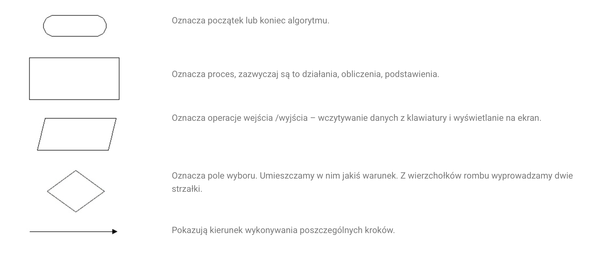
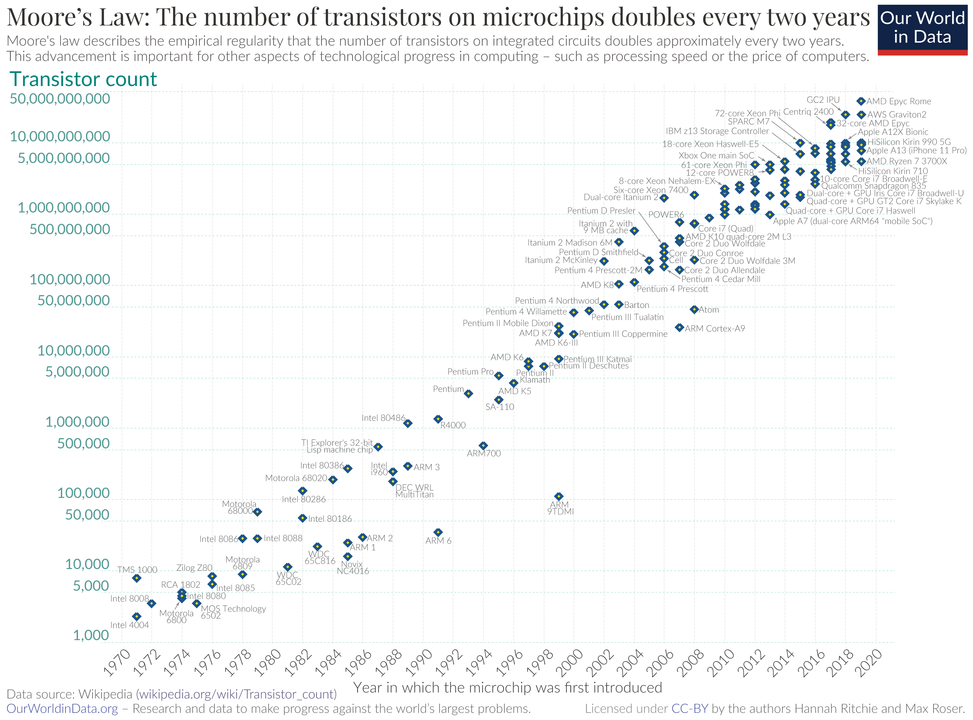

### Polecana literatura

1. Grębosz J.: Symfonia C++ Standard. Edition 2000, 2009.
2. Prata S.: Szkoła programowania. Język C. Helion.
3. Harris S., Ross J.: Algorytmy od podstaw. Helion.
4. Wróblewski P.: Algorytmy, struktury danych i techniki programowania. Helion.
5. Programowanie w C. Wikibooks. http://upload.wikimedia.org/wikibooks/pl/6/6a/C.pdf
6. Pyszczuk A.: Programowanie w języku C. http://www.arturpyszczuk.pl/files/c/pwc.pdf

---

## Algorytm: Przepis na rozwiązanie problemu

Algorytm to precyzyjna instrukcja krok po kroku, jak wykonać konkretne zadanie. 
To abstrakcyjny pomysł, który istnieje zanim jeszcze dotkniemy klawiatury.

### Kluczowe cechy algorytmu:

- **Skończoność:** Musi mieć wyraźny początek i koniec.
- **Jasność:** Każdy krok musi być jednoznaczny dla wykonawcy.
- **Efektywność:** Powinien rozwiązywać problem w optymalny sposób.

### Sposoby zapisu algorytmu:

1. **Opis słowny** (naturalny język).
2. **Pseudokod** (uproszczony zapis przypominający kod).
3. **Schemat blokowy** (wizualna prezentacja logiki).

> Zbiór dobrze zdefiniowanych kroków prowadzących do wykonania pewniego zadania 
>
> Matematycznie - skończony ciąg jasno zdefiniowanych czynności, konieczny do wykonania określonych zadań. 

> Algorytm przeprowadza **stan początkowy** do określonego **stanu końcowego**. 

Badaniem algorytmów zajmuje się algorytmika. 

## Program: Algorytm wcielony w życie

Program to algorytm zapisany w **języku programowania**. 
Język ten stanowi pomost między ludzkim myśleniem a binarną logiką procesora.

### Poziomy abstrakcji języków:

- **Niskopoziomowe (np. Assembler):** Bliskie sprzętowi, trudne dla człowieka, dają pełną kontrolę.
- **Wysokopoziomowe (np. C++, Python, Java):** Bardziej zrozumiałe dla ludzi, ukrywają techniczne detale sprzętu.

```C++
#include <stdio.h> 
main ()
{
    int a = 4;
    int b = 2;
    if (a>=b)
    printf("a większe lub równe");
    else 
        print("a mniejsze lub równe");
    return 0;
}
```
Więcej o aktualnie używanych językach znajdziesz [tutaj](http://www.tiobe.com/index.php/content/paperinfo/tpci/index.html)

Algorytm wygodnie jest wyrażać za pomocą schematu blokowego.
Pokazuje czynności, działania, instrukcej i wzajemne relacje. 






### Jak kod staje się działaniem?

- **Kod źródłowy:** Plik tekstowy napisany przez programistę.
- **Kompilator (C++):** Tłumaczy cały kod na raz do pliku wykonywalnego (szybkość).
- **Interpreter (Python):** Czyta i wykonuje kod linijka po linijce (elastyczność).


##  Paradygmaty: Jak myślimy o programie?

To, jak podchodzimy do pisania programu, zależy od wybranego paradygmatu:

- **Programowanie proceduralne:** Skupiamy się na funkcjach i czynnościach ("zrób to, potem tamto").
- **Programowanie obiektowe (OOP):** Skupiamy się na "bytach" (obiektach), które mają swoje dane i potrafią wykonywać operacje. **To będzie główny temat naszego kursu.**

Oprócz klasycznego podziału na procedury i obiekty, wyróżniamy podejścia, które całkowicie zmieniają sposób pracy z danymi:

- **Programowanie funkcyjne**

Zamiast wydawać komputerowi instrukcje krok po kroku ("zmień tę zmienną"), traktujemy program jak rozwiązywanie funkcji matematycznych.

Kluczowe cechy:

1. Immutability (Niezmienność): Dane raz stworzone nie mogą być zmienione. Zamiast zmieniać listę, tworzymy nową, zmodyfikowaną.
2. Pure Functions (Czyste funkcje): Funkcja dla tych samych danych zawsze zwraca ten sam wynik i nie zmienia nic "na zewnątrz" (brak efektów ubocznych).
3. First-class functions: Funkcje można przekazywać jako argumenty do innych funkcji (tak jak liczby).

Przykłady: Haskell, Lisp, Elixir (oraz nowoczesne dodatki w C++, Java czy JavaScript).

## Programowanie różniczkowalne (Differentiable Programming) & Autograd

To nowoczesny paradygmat, który stał się fundamentem współczesnej Sztucznej Inteligencji (Deep Learning).

Czym jest Autograd? To mechanizm automatycznego różniczkowania (Automatic Differentiation). Pozwala on programowi na automatyczne obliczanie pochodnych funkcji, które sami napisaliśmy.
Dzięki temu algorytm może sam "nauczyć się", jak poprawić swoje parametry, aby zminimalizować błąd (np. w sieciach neuronowych).

**Logika**: Program nie tylko wykonuje operacje, ale potrafi śledzić, jak każda operacja wpłynęła na wynik końcowy, co pozwala na "cofnięcie się" i optymalizację (tzw. backpropagation).

**Przykłady**: Biblioteki takie jak PyTorch, Pennylane, TensorFlow, JAX.

### Programowanie deklaratywne (Declarative)

Opisujesz co chcesz uzyskać, a nie jak ma to zrobić komputer.

Programowanie Logiczne: Definiujesz fakty i relacje, a komputer wyciąga wnioski (np. Prolog).
```prolog
% FAKTY (Facts)
% rodzic(Kto, Kogo).
rodzic(jan, anna).
rodzic(jan, marek).
rodzic(anna, piotr).
rodzic(marek, kasia).

% REGUŁY (Rules)
% X jest dziadkiem Y, JEŻELI X jest rodzicem Z, ORAZ Z jest rodzicem Y.
dziadek(X, Y) :-
    rodzic(X, Z),
    rodzic(Z, Y).

% X i Y są rodzeństwem, JEŻELI mają tego samego rodzica Z,
% ORAZ X i Y to nie ta sama osoba.
rodzenstwo(X, Y) :-
    rodzic(Z, X),
    rodzic(Z, Y),
    X \= Y.
```

Zapytania (SQL): Nie piszesz pętli przeszukującej bazę danych, tylko prosisz: "Daj mi wszystkich użytkowników z Warszawy".

```sql
SELECT * FROM users WHERE city="Warszawa"
```

## Anatomia działającego programu

Gdy uruchamiasz program, system operacyjny tworzy **proces**. 
To "żyjąca" instancja Twojego kodu w pamięci RAM.

| Obszar | Co zawiera? | Rola w programie |
| :--- | :--- | :--- |
| **Segment Kodu** | Instrukcje procesora | "Co mam zrobić?" (np. dodaj, skocz, porównaj) |
| **Segment Danych** | Zmienne, stałe, teksty | "Na czym mam to zrobić?" (np. liczby, imiona, adresy) |

**Mechanizm działania:**

Procesor pobiera instrukcję z segmentu kodu, pobiera potrzebne dane z segmentu danych, wykonuje operację i zapisuje wynik. Jeśli proces przebiega zgodnie z algorytmem, program kończy się sukcesem. Błąd w logice lub naruszenie dostępu do pamięci skutkuje błędem (bugiem).


**Program komputerowy** to sekwencja symboli opisująca obliczenia zgodnie z pewnymi regułami zwanymi językiem programowania. 

Program jest zazwyczaj wykonywany przez komputer, czasami bezpośrednio – jeśli wyrażony jest w języku zrozumiałym dla danej maszyny lub pośrednio – gdy jest kompilowany lub interpretowany przez inny program.

Formalne wyrażenie metody obliczeniowej w postaci języka zrozumiałego dla człowieka nazywane jest **kodem źródłowym**, podczas gdy program wyrażony w postaci zrozumiałej dla
maszyny (to jest za pomocą ciągu zer i jedynek) nazywany jest **kodem maszynowym** bądź
postacią binarną (wykonywalną).

**Kompilator** tłumaczy kod źródłowy zapisany w danym języku programowania na kod maszynowy, dzięki czemu możliwe staje się jego późniejsze uruchomienie. 

**Interpreter** natomiast odczytuje kod źródłowy na bieżąco, analizuje go i wykonuje kolejne porcje przetłumaczonego kodu. 
Programy przeznaczone do interpretacji często nazywane są **skryptami**.


Programy komputerowe można zaklasyfikować według ich zastosowań: aplikacje użytkowe, systemy operacyjne, gry wideo, kompilatory i inne.

W najprostszym modelu **wykonanie programu** polega na umieszczeniu go w pamięci operacyjnej komputera i wskazaniu procesorowi adresu pierwszej instrukcji.
Po tych czynnościach procesor będzie wykonywał kolejne instrukcje programu, aż do jego zakończenia. 

Program może zakończyć się w dwojaki sposób: poprawnie lub błędnie.

Program komputerowy będący w trakcie wykonania nazywany jest **procesem** lub **zadaniem**.

Program można podzielić na dwie części (obszary):

- część kodu (składającą się z instrukcji sterujących działaniem procesora),
- część danych (składającą się z danych wykorzystywanych i opracowywanych przez
program, np. adresów pamięci, stałych liczbowych, komunikatów tekstowych).

Programowanie jest procesem tworzenia programów. Jest to cykliczny proces polegający na:

- edycji kodu źródłowego (implementacja),
- uruchamianiu programu (kompilacja),
- analizie działania,
- powrocie do edycji kodu źródłowego w celu poprawienia błędów lub dalszego posze-
rania funkcjonalności.

Przed przystąpieniem do programowania należy określić cel programu i zaprojektować program (tu przydają się schematy blokowe). 
Kod źródłowy zapisuje się w pliku tekstowym (w języku C plik taki ma rozszerzenie *.c lub *.cpp)


## Proces kompilacji

**Kompilator** to nic innego jak tłumacz. Jego zadaniem jest automatyczne przełożenie kodu napisanego w języku wysokiego poziomu (np. C++ czy Pascal), który rozumie człowiek, na język maszynowy, który rozumie procesor komputera. Ten cały proces nazywamy kompilacją.

Proces ten składa się z dwóch głównych etapów:

1. **Analiza**: Kompilator "czyta" Twój kod, sprawdza, czy jest on poprawnie napisany (nie ma błędów składniowych) i rozbija go na podstawowe, logiczne części, tworząc "wstępny plan" programu (reprezentację pośrednią).
2. **Synteza**: Na podstawie tego "planu" kompilator buduje końcowy program, dostosowując go do konkretnego rodzaju procesora.

Zanim jednak program będzie gotowy do uruchomienia, do pracy włączają się inne ważne programy:

1. **Preprocesor**: To "program przed programem". Działa jeszcze przed właściwym kompilatorem. Jeśli Twój kod jest podzielony na kilka plików, preprocesor zbiera je w jedną całość. Zajmuje się też rozwijaniem tzw. makr, czyli skrótów, które programista napisał, zamieniając je na pełny kod języka źródłowego.
2. **Asembler**: Często kompilator nie tłumaczy kodu źródłowego bezpośrednio na kod maszynowy, ale na język asemblera (język niskiego poziomu, który jest bardzo blisko sprzętu). Wtedy potrzebny jest program zwany asemblerem, który ostatecznie zamienia ten kod na czysty kod maszynowy.
3. **Linker** (Program Łączący): To ostatni etap. Sam kod maszynowy Twojego programu rzadko wystarcza. Twój program często korzysta z gotowych funkcji bibliotecznych (np. do wyświetlania tekstu). Linker łączy kod maszynowy Twojego programu z tymi funkcjami w jeden, gotowy do uruchomienia plik wykonywalny (np. .exe).

Kompilatory, które produkują kod w asemblerze, przekazywany dalej do asemblera (jako programu), nazywane są kompilatorami pośrednimi.

Kod asemblera jest mnemonicznym zapisem kodu maszynowego, w którym używa się nazw
zamiast binarnych kodów operacji i adresów pamięci. 
Typowa sekwencja rozkazów w asemblerze może mieć postać (jest to zapis instrukcji b = a + 2;):
w asemblerze:
```
MOV a, R1
ADD #2, R1
MOV R1, b
```

w kodzie maszynowym:
```
(np.: „0001 01 00 00000000”)
(np.: „0011 01 10 00000010”)
(np.: „0010 01 00 00000100”)
```
### Analiza programu źródłowego 

Analiza kodu: Jak kompilator czyta Twój program?

Proces analizy to rozbieranie Twojego kodu na czynniki pierwsze. Dzieli się na trzy główne fazy:

1. Analiza Leksykalna (Skanowanie / "Dzielenie na słowa")

Kompilator czyta Twój kod znak po znaku (od lewej do prawej) i łączy je w najmniejsze, sensowne "słowa" – nazywamy je tokenami (lub symbolami leksykalnymi). Zbędne spacje i entery są po prostu ignorowane i wyrzucane. Program wykonujący tę pracę to lekser (lub skaner).

Przykład:

Mamy instrukcję: `pozycja := poczatek + tempo * 60`

Lekser potnie ją na następujące klocki (tokeny):

Zmienna (identyfikator): `pozycja`

Znak przypisania: `:=`

Zmienna: `poczatek`

Znak plusa: `+`

Zmienna: `tempo`

Znak mnożenia: `*`

Liczba: `60`

2. Analiza Składniowa (Syntaktyczna / "Sprawdzanie gramatyki")

Skoro kompilator ma już pojedyncze "słowa", musi sprawdzić, czy ułożono je w poprawne "zdanie" zgodnie z regułami danego języka programowania. Z tych rozsypanych klocków buduje hierarchiczną strukturę, pokazującą relacje między nimi. Efektem tej pracy jest najczęściej tzw. **drzewo składniowe** (Abstract Syntax Tree - AST).

Dlaczego drzewo? Dzięki niemu kompilator wie, w jakiej kolejności wykonywać działania. Drzewo pokaże mu, że mnożenie (tempo * 60) jest zagnieżdżone głębiej i musi zostać wykonane przed dodaniem wyniku do zmiennej poczatek.

3. Analiza Semantyczna ("Sprawdzanie logiki i sensu")

Zdanie może być poprawne gramatycznie, ale nie mieć żadnego sensu (np. "Kwadratowy dźwięk zjadł kolor"). Analiza semantyczna sprawdza, czy kod ma sens z punktu widzenia logiki programowania.

Korzystając z drzewa zbudowanego w poprzednim kroku, kompilator wyszukuje błędy logiczne. Jego najważniejszym zadaniem tutaj jest kontrola typów.

Sprawdza np., czy nie próbujesz pomnożyć tekstu ("Jan Kowalski") przez liczbę (60).

Upewnia się, czy zmienne, których używasz, zostały wcześniej prawidłowo zadeklarowane.

Jeśli kod przejdzie pomyślnie przez te trzy filtry, kompilator "rozumie" już wszystko i może przejść do kolejnego wielkiego etapu – syntezy (czyli generowania faktycznego kodu maszynowego).

### Faza kompilatora

Kompilator to nie jest jeden wielki, niepodzielny program, ale raczej linia montażowa w fabryce. Kod przechodzi przez kolejne stanowiska:

**Skaner** (Lekser): Pracownik od "wyłapywania słów". Ignoruje spacje, entery i komentarze. Dzieli Twój tekst na najmniejsze elementy (tokeny), np. wyłapuje, że int to typ danych, a + to operator.

**Parser** (Analizator składniowy): Pracownik od gramatyki. Bierze słowa od skanera i układa z nich poprawne "zdania" (buduje wspomniane wcześniej drzewo składniowe). Sprawdza, czy nie zapomniałeś średnika na końcu linii.

**Generator**: Tłumacz właściwy. Bierze sprawdzone i poukładane klocki z poprzednich etapów i zamienia je na kod docelowy (często kod maszynowy lub asembler).

**Optymalizator**: Redaktor, który "odchudza" program. Zmienia kod tak, aby komputer wykonywał go szybciej lub zużywał mniej pamięci RAM, nie zmieniając przy tym wyniku jego działania (np. usuwa kod, który i tak nigdy się nie wykona).

**Konsolidator** (Linker): Introligator. Twój program rzadko jest jednym plikiem. Linker bierze wszystkie skompilowane kawałki (Twój kod + gotowe biblioteki, np. do wyświetlania grafiki) i skleja je w jeden ostateczny, działający plik wykonywalny (np. .exe).

#### Tablica symboli: "Notatnik kompilatora"

Kompilator podczas swojej pracy używa Tablicy symboli. 
Wyobraź to sobie jako notatnik lub książkę adresową, którą kompilator trzyma na biurku.

Gdy tylko w kodzie zadeklarujesz nową zmienną (np. int liczba_studentow;), kompilator zapisuje w notatniku:

Nazwa: liczba_studentow

Typ: liczba całkowita (int)

Ile zajmuje miejsca: 4 bajty

Dzięki temu, gdy w kolejnych linijkach kodu użyjesz słowa liczba_studentow, kompilator szybko zagląda do notatnika i już wie, o czym mowa.

#### Klasyfikacja błędów: Co może pójść nie tak?

1. **Błędy Leksykalne** (Literówki w słowach kluczowych): Napisanie whille zamiast while, albo użycie nieznanego znaczka np. $. Skaner patrzy na to i mówi: "Nie znam takiego słowa".

2. **Błędy Składniowe** (Zła interpunkcja i gramatyka): Np. brakujący średnik ; na końcu instrukcji, albo zapomnienie o zamknięciu nawiasu `(a + b`. Parser krzyczy: "Zdanie nie jest dokończone!".

3. **Błędy Semantyczne** (Brak logiki typów): Składnia jest poprawna, ale operacja nie ma sensu w świecie programowania. Np. próba pomnożenia tekstu przez liczbę: `"Kasia" * 5`. Kompilator wie, że to bez sensu.

**Błędy Logiczne** (Najgorszy koszmar programisty): Program kompiluje się bez ani jednego błędu, ale robi coś innego, niż chciałeś. Np. kazałeś mu szukać największej liczby, a on znajduje najmniejszą, albo wchodzi w tzw. nieskończoną pętlę i zawiesza komputer. Kompilator tych błędów nie wykryje, bo dla niego kod jest poprawny – komputer robi to, co mu kazałeś, a nie to, co miałeś na myśli. Tutaj właśnie na ratunek wkracza wspomniany wcześniej debugger.


## Fazy analizy – co dzieje się pod maską?

Podczas całego procesu translacji, Twój program nieustannie zmienia swoją postać. Zwykły tekst powoli staje się strukturą zrozumiałą dla maszyny.

Głębsze spojrzenie na analizę leksykalną (Leksemy i Wartości):

- Skaner grupuje znaki w logiczne ciągi zwane leksemami. Niektóre z nich są wzbogacane o tzw. wartość leksykalną.
Wyobraź sobie, że skaner napotyka słowo tempo. Zamiast pchać całe to słowo dalej, generuje krótki symbol, np. `id` (od identyfikatora), a samo słowo tempo zapisuje w naszej Tablicy Symboli (notatniku). 
Od tego momentu wartość leksykalna symbolu id to po prostu wskaźnik mówiący: "hej, szczegóły tej zmiennej znajdziesz w notatniku na stronie X". To ogromna oszczędność pamięci.

### Struktura Węzłów:

Gdy parser buduje hierarchiczne drzewo składniowe z symboli podesłanych przez skaner, używa do tego  rekordów:

1. Węzły wewnętrzne (Gałęzie): Mają pole z operatorem (np. + lub *) oraz wskaźniki (ramiona) prowadzące do lewego i prawego "potomka" (czyli elementów, na których wykonujemy operację).
2. Liście (Końcówki drzewa): Zawierają konkretne symbole leksykalne (np. liczby lub wskaźniki do Tablicy Symboli).

### Generacja kodu pośredniego (Język uniwersalny)

Gdy kompilator skończy analizę i wie, że kod jest poprawny, nie rzuca się od razu do pisania czystego kodu maszynowego. Najpierw tworzy "brudnopis" – **kod pośredni**. 
Jest to uniwersalny kod dla wymyślonej, abstrakcyjnej maszyny. Łatwo go wygenerować z drzewa składniowego i równie łatwo przetłumaczyć później na język konkretnego procesora (np. Intela czy ARM).

Najpopularniejszym formatem jest kod trójadresowy. Przypomina on prosty asembler, ale obowiązują w nim rygorystyczne zasady:

Kompilator sam musi tworzyć tymczasowe zmienne (zaczynające się np. od temp), aby zapamiętywać kroki pośrednie.

### Optymalizacja kodu (Odchudzanie programu)

Ten etap to czas dla "redaktora". 
Jego zadaniem jest poprawienie brudnopisu (kodu pośredniego), aby gotowy program działał szybciej lub zajmował mniej miejsca, nie zmieniając oczywiście jego ostatecznego wyniku działania.

Spójrzmy na poprzedni przykład kodu trójadresowego. Sprytny optymalizator zauważy, że liczba 60 jest stała i możemy pominąć jej konwersję w trakcie działania programu. Skróci więc cztery linijki do zaledwie dwóch!

### Generacja kodu maszynowego

To ostatni przystanek. Zoptymalizowany brudnopis (kod pośredni) jest ostatecznie tłumaczony na przemieszczalny kod maszynowy (lub kod asemblera) dla konkretnego procesora. 
To tutaj dzieje się "fizyczna" magia:

- Każdej zmiennej z Tablicy Symboli zostaje przypisany konkretny adres w pamięci RAM.
- Zmienne najczęściej używane są "promowane" i trafiają do najszybszej pamięci w komputerze – **rejestrów procesora**.